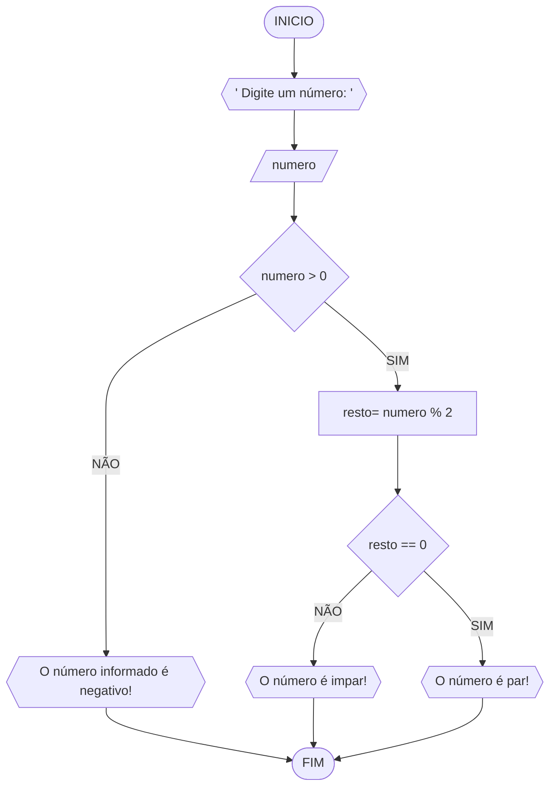

# UNIFOR 
**Disciplina:** Raciocinio Lógico e Algoritimos
**Orientador**:Prof: Ricardo Carubbi 

## Lista de exercícios 
### Exercício 03 
Represente , em fluxograma e pseudocódigo, um algorítimo para determinar se o número inteiro positivo é par ou ímpar
#### Fluxograma 

#### Pseudocódigo
```
1  ALGORITMO verifica_par_impar 
2  DECLARE numero, resto NUMERICO
3  ESCREVA "Digite um número: "
4  LEIA numero 
5  SE numero > 0 ENTAO 
6    resto = numero % 2
7    SE resto == 0 ENTAO 
8        ESCREVA "O número é par!"
9    SENAO 
10       ESCREVA "O número é impar!"
11  SENAO 
12       ESCREVA "O número deve ser positivo!"
13 FIM_ALGORITMO
```
