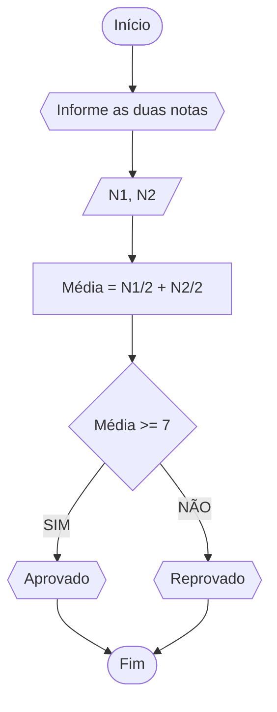
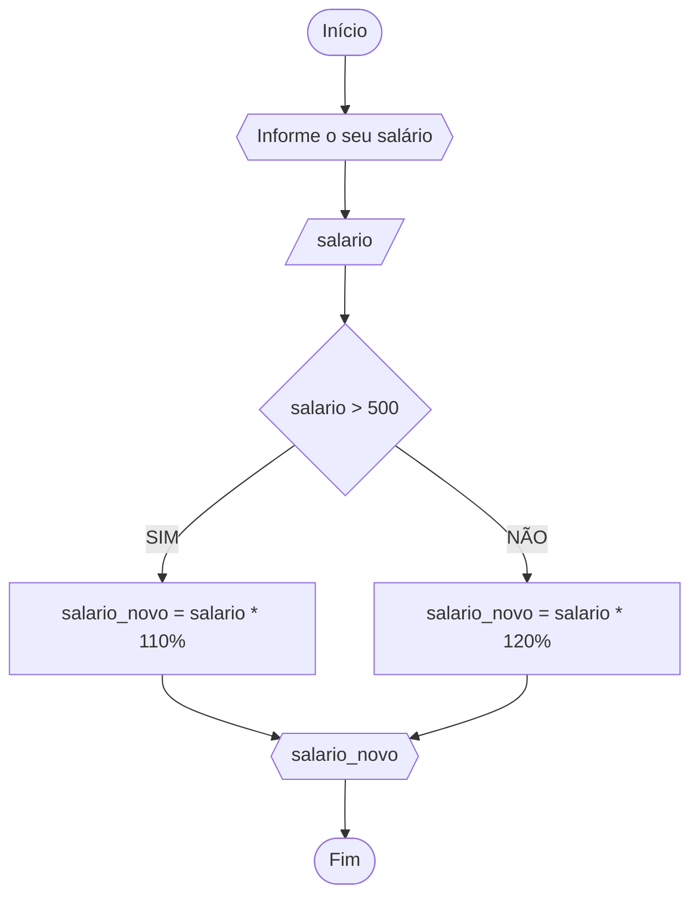
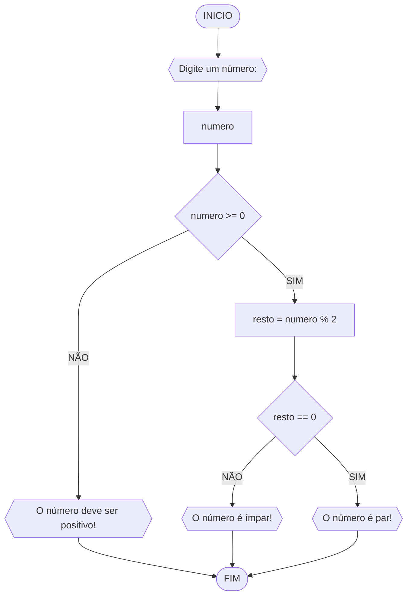
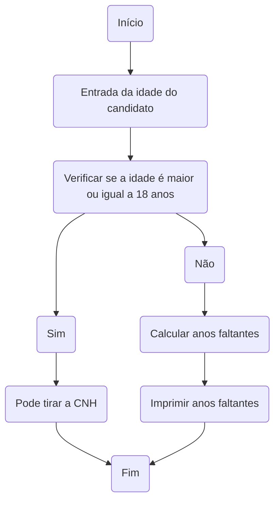

# UNIFOR 
**Disciplina:** Raciocinio Lógico e Algoritimos
**Orientador**:Prof: Ricardo Carubbi 

## Lista de exercícios 
### Exercício 01
Represente, em fluxograma e pseudocódigo, um algoritmo para calcular a média aritmética entre
duas notas de um aluno e mostrar sua situação, que pode ser aprovado ou reprovado;

#### Fluxograma 

#### Pseudocódigo 
```
ALGORITMO
DECLARE N1, N2, M NUMÉRICO 
ESCREVA “Digite as duas notas” 
LEIA N1, N2 
M = (N1+N2)/2
SE M >= 7
	ENTÃO ESCREVA “Aprovado” 
SENÃO  
	ESCREVA “Reprovado“ 
FIM_ALGORITMO.
```


#### Teste de mesa 
| NOTA 1       | NOTA 2       | MÉDIA=N1+N2/2 |SITUAÇÃO 
|      --      |      --      |      --         |    --    |
| 10           | 6            | 8             | Aprovado 
| 5            | 9            | 7             | Aprovado 
| 3            | 4            | 3,5           | Reprovado 

### Exercício 02
Represente, em fluxograma e pseudocódigo, um algoritmo para calcular o novo salário de um
funcionário. Sabe-se que os funcionários que recebem atualmente salário de até R$ 500 terão
aumento de 20%; os demais terão aumento de 10%.

#### Fluxograma


#### Pseudocódigos 
```
ALGORITMO
DECLARE salario, salario_novo NUMÉRICO 
ESCREVA “Digite seu salário” 
LEIA salario
SE salario > 500
	ENTÃO
		salario_novo = salario * 110%
		ESCREVA "salario_novo"
SENÃO
	salario_novo = salario * 120%
	ESCREVA “salario_novo“ 
FIM_ALGORITMO.
```


#### Teste de mesa 
| Salário  | Exemplo 01/salário R$400 | Exemplo 02/salário R$1000 |  
|      --      |      --      |      --      |   
| Salário igual ou menor que R$500    | Salário ficou R$480       | //   |  
| Salário maior que R$500   | //         | Salário ficou R$1,100        | 


### Exercicio 3
Represente, em fluxograma e pseudocódigo, um algoritmo para determinar se um número inteiro
e positivo é par ou impar

#### Fluxograma 
#### Fluxograma

#### Pseudocódigo
```
	ALGORITMO verifica_par_impar
	DECLARE numero, resto NUMERICO
	ESCREVA "Digite o número: "
	LEIA numero
	SE numero >= 0 ENTAO
		resto <- numero % 2
		SE resto == 0 ENTAO
			ESCREVA "O número é par"
		SENAO
			ESCREVA "O número é ímpar"
	SENAO
		ESCREVA "O número deve ser positivo"
	FIM_ALGORITMO
```
#### Teste de mesa 
| numero | Número Impar ou Par |
| -- | -- |
| 1|Impar | 
| 4  |Par|
| 13 | Impar| 
| 20 | Par |  

### Exercicio 4
Represente, em fluxograma e pseudocódigo, um algoritmo que, a partir da idade do candidato(a),
determinar se pode ou não tirar a CNH. Caso não atender a restrição de idade, calcular quantos
anos faltam para o candidato estar apto

#### Fluxograma 


#### Pseudocódigo
```
ALGORITMO verifica_idade_CNH
DECLARE idade, AnosFaltantes NUMERICO
ESCREVA "Idade do condidato "
LEIA verificar a idade
SE idade < 18 ENTAO
	AnosQueFaltam <- 18 - idade
    ESCREVA "Ainda restam 'anosQueFalta' anos para tirar a CNH"
	SENAO
	ESCREVA " Pode tirar a CNH!"
FIM_ALGORITMO
```
#### Teste de mesa 

| Idade  | Situação para tirar CNH | Anos Faltantes
| --  |  --  |  --  |
| 18 Anos  | Aprovaado| 0 anos |
| 15 Anos  | Reprovado| 3 anos 


