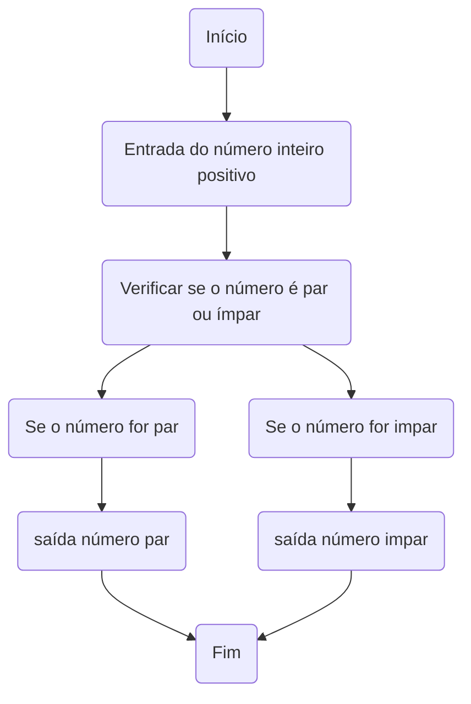
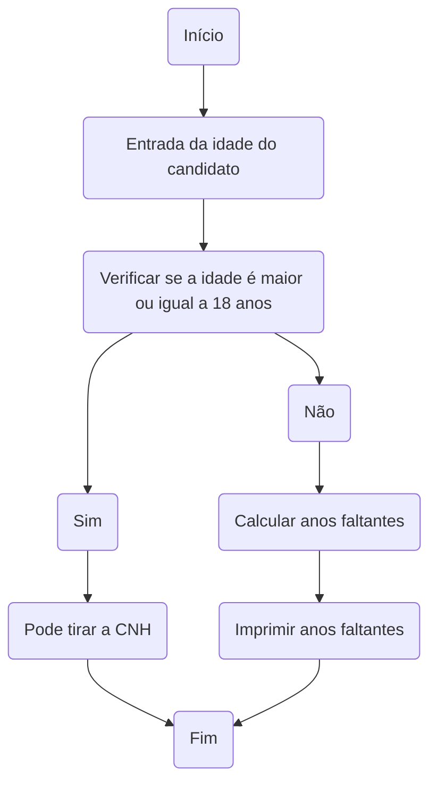

# UNIFOR 
**Disciplina:** Raciocinio Lógico e Algoritimos
**Orientador**:Prof: Ricardo Carubbi 

## Lista de exercícios 
### Exercício 01
Represente, em fluxograma e pseudocódigo, um algoritmo para calcular a média aritmética entre
duas notas de um aluno e mostrar sua situação, que pode ser aprovado ou reprovado;

#### Fluxograma 
```mermaid
flowchart TD
    A(Início) --> B{{Entrada da primeira nota}}
    B --> C{{Entrada da segunda nota}};
    C --> D[/Calcular a média aritmética/];
    D --> E(Verificar se a média é maior ou igual a 6);
    E --> F(Sim);
    F --> G(Aprovado)
    G --> H(FIM)
    E --> I(Não)
    I --> J(Reprovado)
    J --> H(Fim)
 ```

#### Pseudocódigo

#### Teste de mesa 
| Notas  | Calculo |
|      --      |      --      | 
| Nota 1     | 8       |
| Nota 2   | 6       | 
| Média Aritmética |8+6/2=7 
| Média = | 7 / APROVADO

### Exercício 02
Represente, em fluxograma e pseudocódigo, um algoritmo para calcular o novo salário de um
funcionário. Sabe-se que os funcionários que recebem atualmente salário de até R$ 500 terão
aumento de 20%; os demais terão aumento de 10%.

#### Fluxograma

```mermaid
flowchart TD
   
    A(Início) --> B(Entrada do salário atual);
    B --> C(Verificar se o salário atual é menor ou igual a R$ 500);
    C --> D(Sim);
    D --> E(Calcular aumento de 20%);
    E --> F(Calcular novo salário);
    F --> G(saída novo salário);
    G --> H(Fim);
    C --> I(Não);
    I --> J(Calcular aumento de 10%);
    J --> K(Calcular novo salário);
    K --> G;


```
#### Pseudocódigo 


#### Teste de mesa 
| Salário  | Exemplo 01/salário R$400 | Exemplo 02/salário R$1000 |  
|      --      |      --      |      --      |   
| Salário igual ou menor que R$500    | Salário ficou R$480       | //   |  
| Salário maior que R$500   | //         | Salário ficou R$1,100        | 


### Exercicio 3
Represente, em fluxograma e pseudocódigo, um algoritmo para determinar se um número inteiro
e positivo é par ou impar

#### Fluxograma 

#### Pseudocódigo

#### Teste de mesa 
| numero | Número Impar ou Par |
| -- | -- |
| 1|Impar | 
| 4  |Par|
| 13 | Impar| 
| 20 | Par |  

### Exercicio 4
Represente, em fluxograma e pseudocódigo, um algoritmo que, a partir da idade do candidato(a),
determinar se pode ou não tirar a CNH. Caso não atender a restrição de idade, calcular quantos
anos faltam para o candidato estar apto

#### Fluxograma 


#### Pseudocódigo 
ALGORITMO verifica_idade_CNH
DECLARE idade, AnosFaltantes NUMERICO
ESCREVA "Idade do condidato "
LEIA verificar a idade
SE idade < 18 ENTAO
	AnosQueFaltam <- 18 - idade
    ESCREVA "Ainda restam 'anosQueFalta' anos para tirar a CNH"
	SENAO
	ESCREVA " Pode tirar a CNH!"
FIM_ALGORITMO
#### Teste de mesa 

| Idade  | Situação para tirar CNH | Anos Faltantes
| --  |  --  |  --  |
| 18 Anos  | Aprovaado| 0 anos |
| 15 Anos  | Reprovado| 3 anos 


