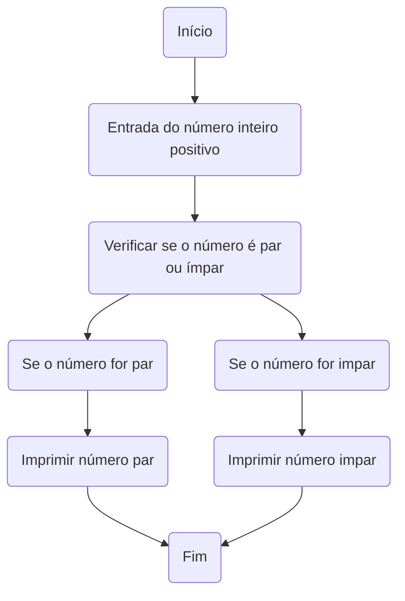

# UNIFOR 
**Disciplina:** Raciocinio Lógico e Algoritimos
**Orientador**:Prof: Ricardo Carubbi 

## Lista de exercícios 
### Exercício 01
Represente, em fluxograma e pseudocódigo, um algoritmo para calcular a média aritmética entre
duas notas de um aluno e mostrar sua situação, que pode ser aprovado ou reprovado;

#### Fluxograma 
```mermaid
flowchart TD
    A(Início) --> B{{Entrada da primeira nota}}
    B --> C{{Entrada da segunda nota}};
    C --> D[/Calcular a média aritmética/];
    D --> E(Verificar se a média é maior ou igual a 6);
    E --> F(Sim);
    F --> G(Aprovado)
    G --> H(FIM)
    E --> I(Não)
    I --> J(Reprovado)
    J --> H(Fim)
 ```

#### Pseudocódigo

### Exercício 02
Represente, em fluxograma e pseudocódigo, um algoritmo para calcular o novo salário de um
funcionário. Sabe-se que os funcionários que recebem atualmente salário de até R$ 500 terão
aumento de 20%; os demais terão aumento de 10%.

#### Fluxograma

```mermaid
flowchart TD
   
    A(Início) --> B(Entrada do salário atual);
    B --> C(Verificar se o salário atual é menor ou igual a R$ 500);
    C --> D(Sim);
    D --> E(Calcular aumento de 20%);
    E --> F(Calcular novo salário);
    F --> G(Imprimir novo salário);
    G --> H(Fim);
    C --> I(Não);
    I --> J(Calcular aumento de 10%);
    J --> K(Calcular novo salário);
    K --> G;


```
#### Pseudocódigo 


#### Teste de mesa 
| Salário  | Exemplo 01/salário R$400 | Exemplo 02/salário R$1000 |  
|      --      |      --      |      --      |      --      |      --      | 
| Salário igual ou menor que R$500    | Salário ficou R$480       | //   |  alinhar     | as barras    |
| Salário maior que R$500   | //         | Salário ficou R$1,100        | obrigatório. | Entendido ?  |


### Exercicio 3
Represente, em fluxograma e pseudocódigo, um algoritmo para determinar se um número inteiro
e positivo é par ou impar

#### Fluxograma 

#### Pseudocódigo

### Exercicio 4
Represente, em fluxograma e pseudocódigo, um algoritmo que, a partir da idade do candidato(a),
determinar se pode ou não tirar a CNH. Caso não atender a restrição de idade, calcular quantos
anos faltam para o candidato estar apto

#### Fluxograma 
```mermaid 
flowchart TD

    A(Início) --> B(Entrada da idade do candidato);
    B --> C(Verificar se a idade é maior ou igual a 18 anos);
    C --> D(Sim);
    D --> E( Pode tirar a CNH);
    E --> F(Fim);
    C --> G(Não);
    G --> H(Calcular anos faltantes);
    H --> I(Imprimir anos faltantes);
    I --> F(Fim);
    
    ``` 
    


