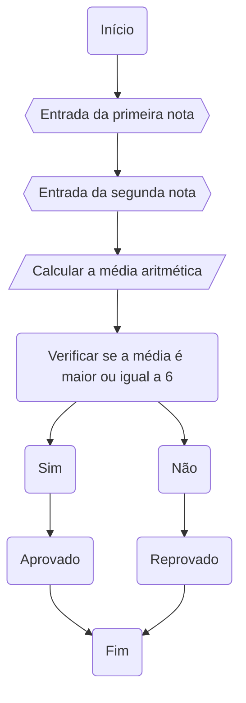

#Lista de exercicios 
##Exercicio 01
###Fluxograma

```mermaid
flowchart TD
    A(Início) --> B{{Entrada da primeira nota}}
    B --> C{{Entrada da segunda nota}};
    C --> D[/Calcular a média aritmética/];
    D --> E(Verificar se a média é maior ou igual a 6);
    E --> F(Sim);
    F --> G(Aprovado)
    G --> H(FIM)
    E --> I(Não)
    I --> J(Reprovado)
    J --> H(Fim) 

```
