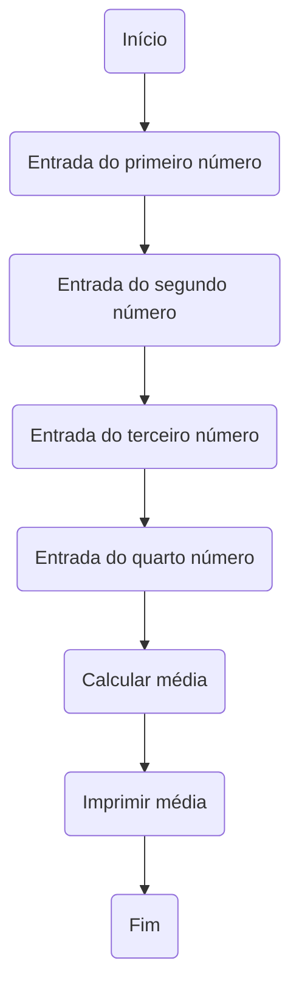
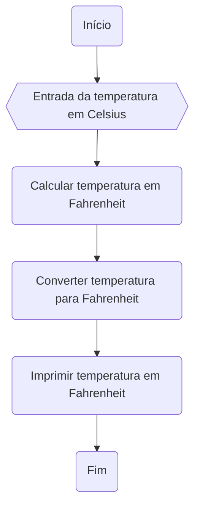

# UNIFOR
**Nome**: Nome do estudante  
**Disciplina**: Raciocínio lógico algorítm

## Exercício 01
Calcule a média de quatro números inteiros dados.
#### Fluxograma (1.0 ponto)

#### Pseudocódigo 

#### Teste de mesa 
| Números      | 
|      --      | 
| 5            | 
| 7            |
| 2            |
| 13           |
|Total= 27     |
| Média = 13,5 |

## Exercicio 02 

#### Fluxograma 

#### Pseudocódigo 
ALGORITMO converter_tempertura 
DECLARE TC, TF
ESCREVA "Digite a temperatura em graus celsius"
LEIA TC
TF=(9/5*TC+32
ESCREVA "A temperatura em graus fahrenheit é"
FIM
#### Teste de mesa
|  TC  | TF= (9/5) * TC + 32 | SAIDA
|      --      |    --    |    --    |
| 37  | 98.6  | "A temperatura em Fahrenheit é 98.6 |
| 12  | 53.6  | "A temperatura em Fahrenheit é 56.6 |

