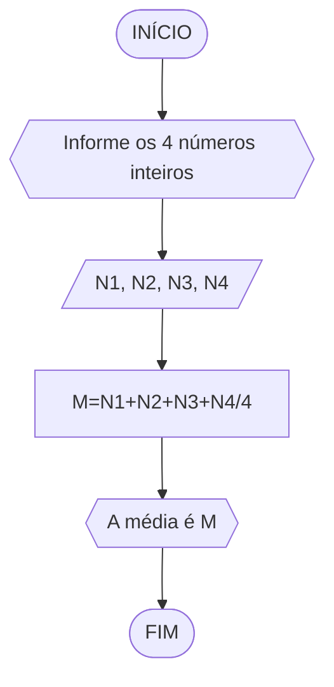
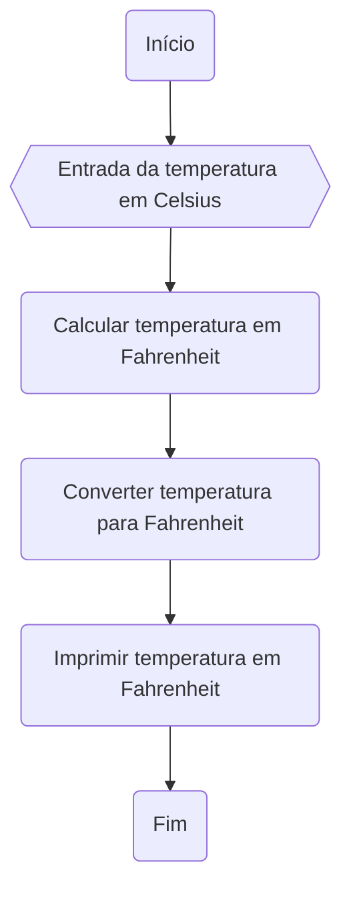
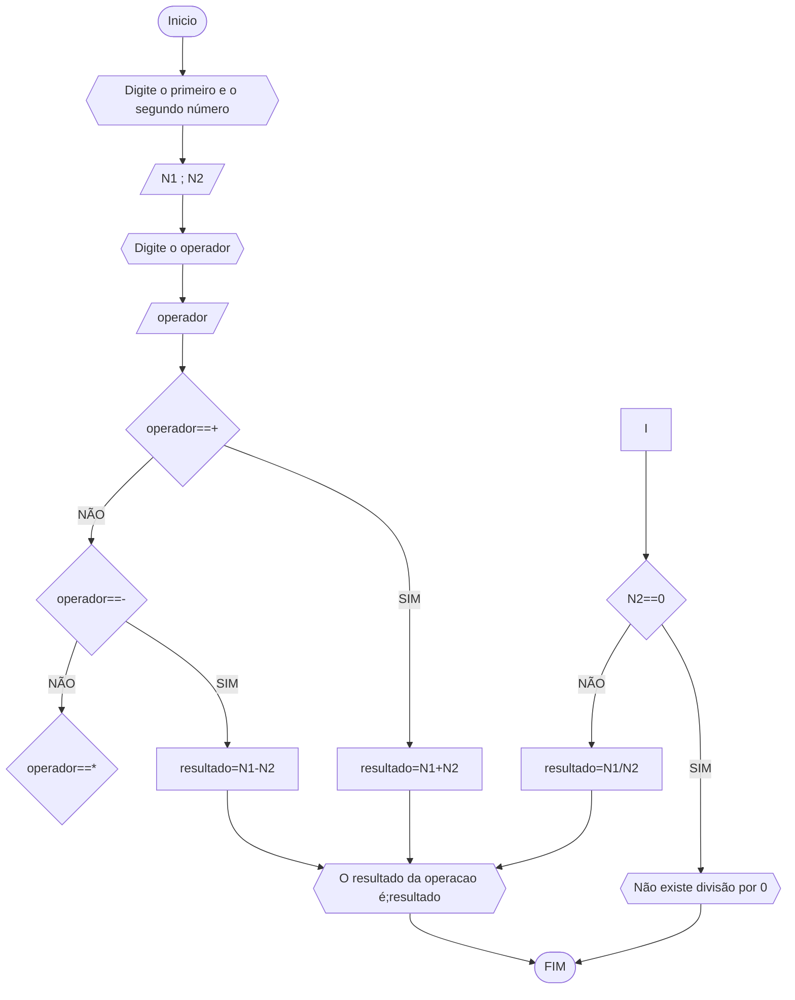

# UNIFOR
**Nome**: Nome do estudante <br>
**Disciplina**: Raciocínio lógico algorítm

## Exercício 01
Calcule a média de quatro números inteiros dados.
#### Fluxograma (1.0 ponto)



#### Pseudocódigo 

```
ALGORITMO
DECLARE N1,N2,N3,N4 : INTEIRO
M : REAL
INICIO
ESCREVA "Informe os 4 números inteiros: "
LEIA N1,N2,N3,N4
M=(N1+N2+N3+N4)/4
ESCREVA " A média é: ",M
FIM

```
#### Teste de mesa 
| N1 | N2 | N3 | N4 | M=(N1+N2+N3+N4)/4 | SAÍDA |
|      --      |      --      |      --      |      --      |      --      |    --    |
| 2     | 4      | 3  |  3     |  3   |      " A média é: 3 "    |
| 10   | 23        | 7        | 20 | 15  |    " A média é: 15 "       |
| 7  | 8         | 5       | 8 | 7  |     " A média é: 7 "      |

## Exercicio 02 

#### Fluxograma 


#### Pseudocódigo 
```
1 ALGORITMO converter_tempertura 
2 DECLARE TC, TF
3 ESCREVA "Digite a temperatura em graus celsius"
4 LEIA TC
5 TF=(9/5*TC+32
6 ESCREVA "A temperatura em graus fahrenheit é"
7 FIM
```

#### Teste de mesa
|  TC  | TF= (9/5) * TC + 32 | SAIDA
|      --      |    --    |    --    |
| 37  | 98.6  | "A temperatura em Fahrenheit é 98.6 |
| 12  | 53.6  | "A temperatura em Fahrenheit é 56.6 |

## Exercicio 03 
Receba dois números reais e um operador e efetue a operação correspondente com os
valores recebidos (operandos). O algoritmo deve retornar o resultado da operação
selecionada simulando todas as operações de uma calculadora simples
obs;muita dificuldade 
#### Fluxograma 


#### Pseudocódigo 
```
ALGORITMO calculadora
DECLARE N1, N2, resultado: REAL
		operador: CARACTERE
INICIO
ESCREVA "Digite o primeiro número: "
LEIA N1
ESCREVA "Digite o segundo número: "
LEIA N2
ESCREVA "Digite o operador: "
LEIA operador
ESCOLHA
	CASO operador=="+"
		resultado=N1+N2
	CASO operador=="-"
		resultado=N1-N2
	CASO operador=="*"
		resultado=N1*N2
	CASO operador=="/"
		SE N2==0 ENTÃO
			ESCREVA "Não existe divisão por zero!"
		SENÃO
			resultado=N1/N2
		FIM_SE
FIM_ESCOLHA
ESCREVA "O resultado da operação é: ", resultado
FIM	
```
#### Teste de mesa 

| LEIA N1 | LEIA N2 | LEIA operador | operador=="+"| operador=="-" | operador=="*" |operador=="/" | SAÍDA |
|    --   |   --    |       --      |      --      |      --       |    --         |    --        |   --  | 
| 7       | 3       | +             |        V     |          F    |            F  |            F | "O resultado da operação é: 10"  |
| 2       | 4       |     *         |         F    |       F       |       V       |     F        |  "O resultado da operação é: 8" |
| 5       |  5      |     /         |            F |            F  |            F  |            V |  "O resultado da operação é 1 " |


