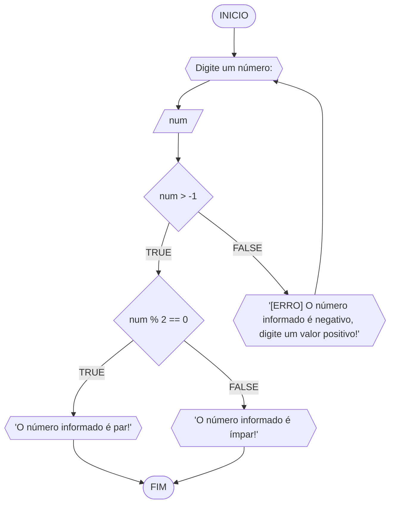

# UNIFOR
**Nome**: Cauã Aguiar
**Disciplina**: Raciocínio lógico algorítmico
### Exercício 01 
Atualize o algoritmo para determinar se um número inteiro e positivo é par ou ímpar, usando uma laço condicional para aceitar apenas números maiores ou iguais a zero. 

#### Fluxograma 

#### Pseudocódigo 
```
	ALGORITMO par_impar
	DECLARE num: INTEIRO
	INICIO
	ESCREVA 'Digite um número: '
	LEIA num
	SE num < 0 ENTAO
		REPITA
			ESCREVA '[ERRO] O número informado é negativo, digite um valor positivo: '
			LEIA num
		ATE_QUE num > -1

	SE num % 2 == 0 ENTAO
		ESCREVA 'O número informado é par!'
	SENAO 
		ESCREVA 'O número informado é ímpar!'
	FIM_ALGORITMO
```

### Teste de Mesa

| num | num > -1 | num % 2 == 0 | Saída
|--- |--- |--- |--- |
| 0 | true | true | 'O número informado é par!' |
| 5 | true | false | 'O número informado é ímpar!'|
| 4 | true | true | 'O número informado é par!' 

### Exercicio 02
Faça um algoritmo que exiba na tela uma contagem de 0 até 30, exibindo apenas os múltiplos de 3.
obs;duvida all

#### Fluxograma 
 ```mermaid
flowchart TD
A([INICIO]) --> B[/n, num/]
B --> C[n = 30]
C --> D[num = 1]
D --> E{num <= n}
E --FALSE--> H([FIM])
E --TRUE--> F{{"'Número ', num"}}
F --> G[num =+ 1]
G --> E
```
#### Pseudocódigo 
```
	ALGORITMO contagem_1_a_30
	DECLARE n, num: INTEIRO
	INICIO
	n <- 30
	num <- 1
	ENQUANTO num <= n FAÇA
		ESCREVA “Número ”, num
		num ← num + 1
	FIM_ENQUANTO
	FIM
```
#### Teste de mesa

| it | n | num | num <= n | Saída | num =+ 1 |
|--- |--- |--- |--- |--- |--- |
| 1º | 30 | 1 | true | Número 1 | 2 |
| 2º | 30 | 2 | true | Número 2 | 3 |
| 3º | 30 | 3 | true | Número 3 | 4 |
| 30º | 30 | 30 | true | Número 30 | 31 |
| 31º | 30 | 31 | false 


### Exercicio 03 
Dada uma sequência de números inteiros, calcular a sua soma. 
Por exemplo, para a sequência {12, 17, 4, -6, 8, 0}, o seu programa deve escrever o número 35.
#### Fluxograma 
````mermaid
flowchart TD
A([Início]) --> B{{Digite seis números para a sequência:}}
B --> C[\N1, N2, N3, N4, N5, N6\]
C --> D[soma = 0]
D --> E[[i = N1 ATÉ N6]]
E --> G{{'A soma da sequência é:', soma}}
E --> F[soma =+ i]
G --> H([Fim])
F --LOOP--> E
````
#### Pseudocódigos 

#### Teste de mesa 

### Exercicio 04 
Escreva um programa que leia a nota de diversos alunos, até que seja digitada uma nota
negativa. Nesse momento, ele mostra a média aritmética de todas as notas lidas e quantas
notas foram lidas. Ex. Foram lidas 14 notas. A média aritmética é 6.75!
#### Fluxograma 
